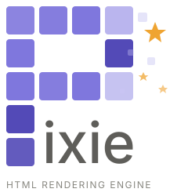
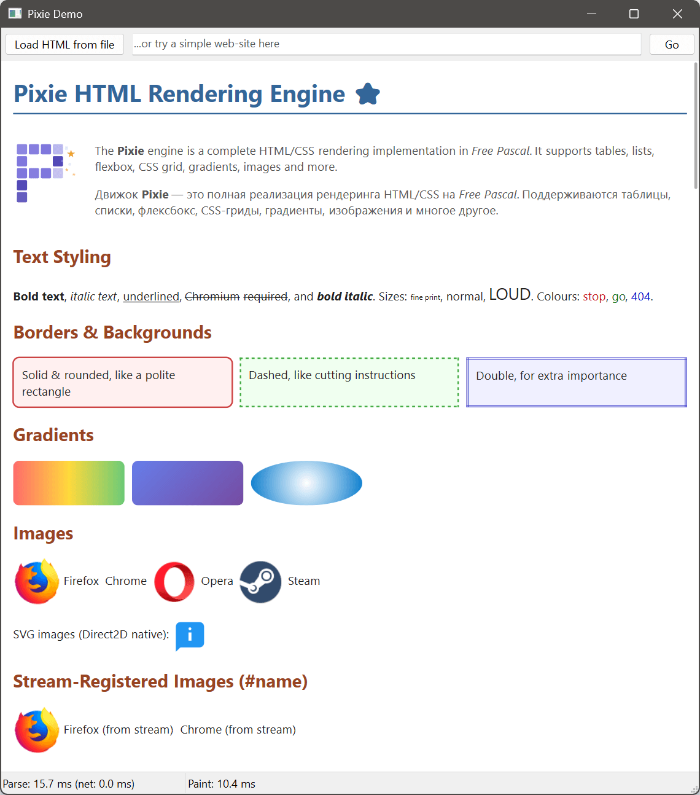
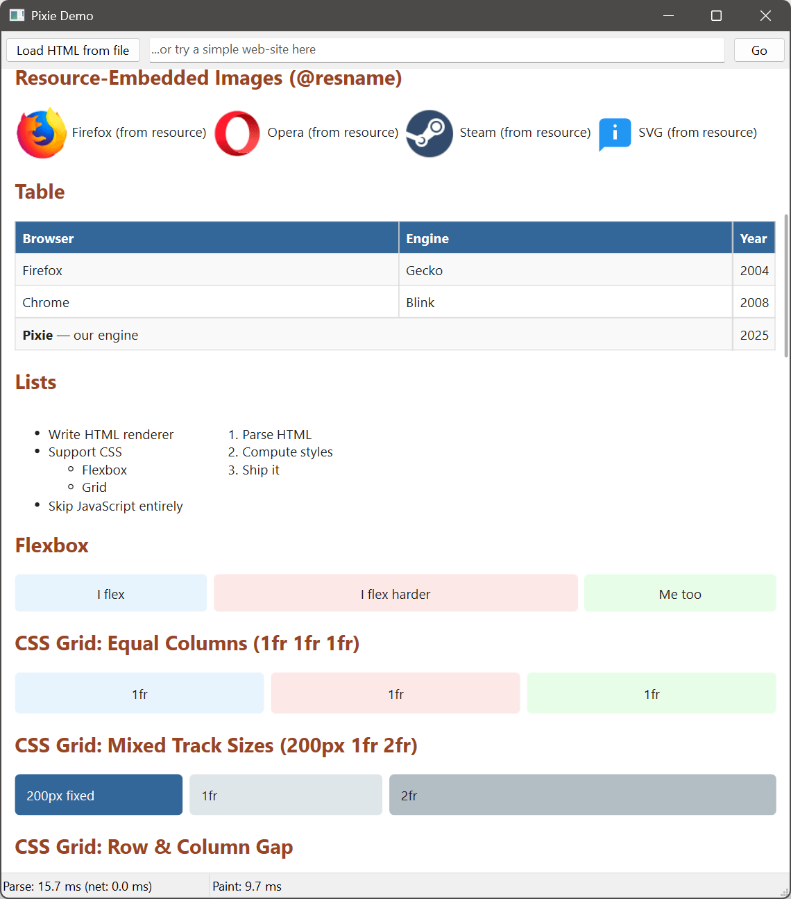
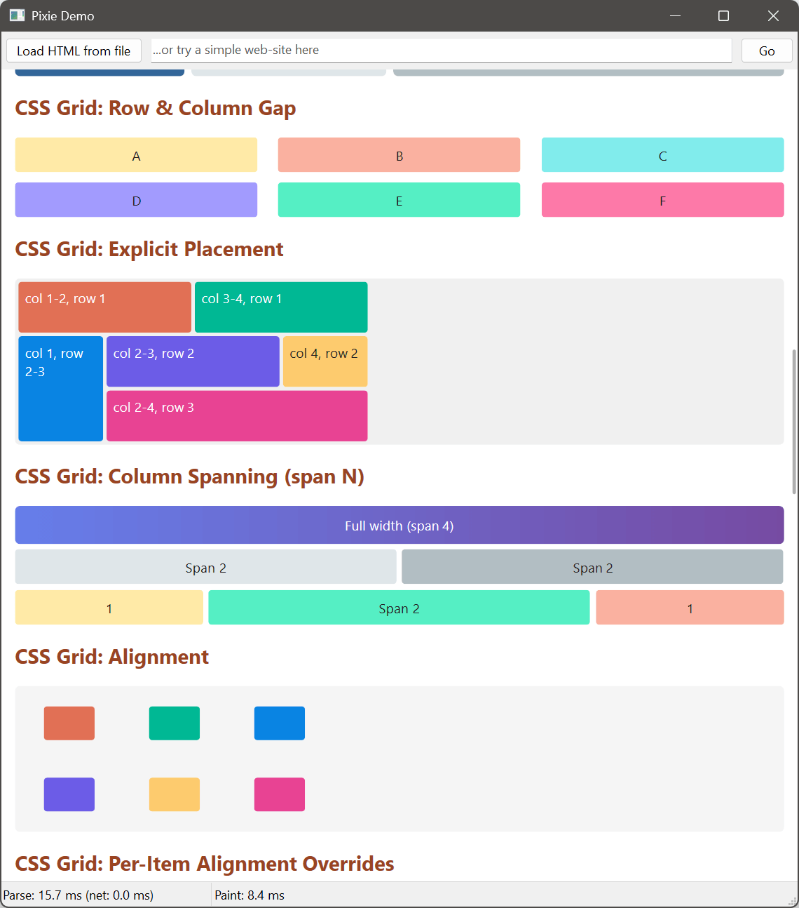
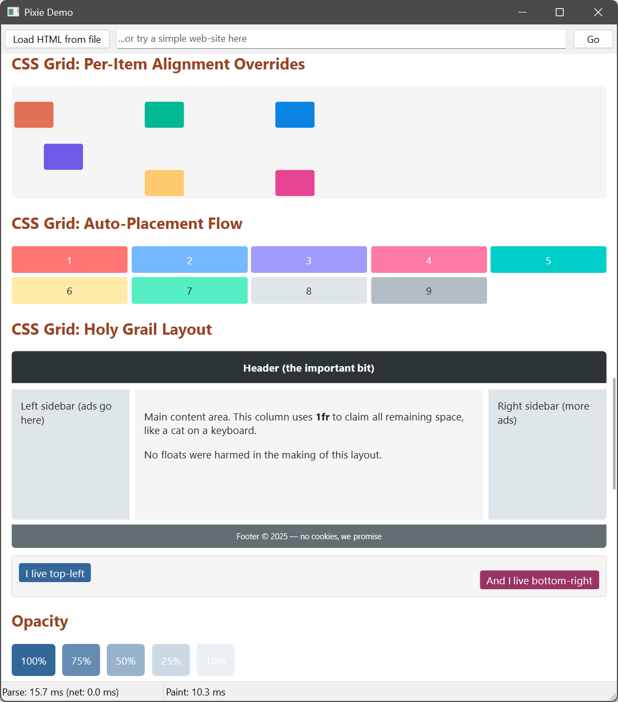
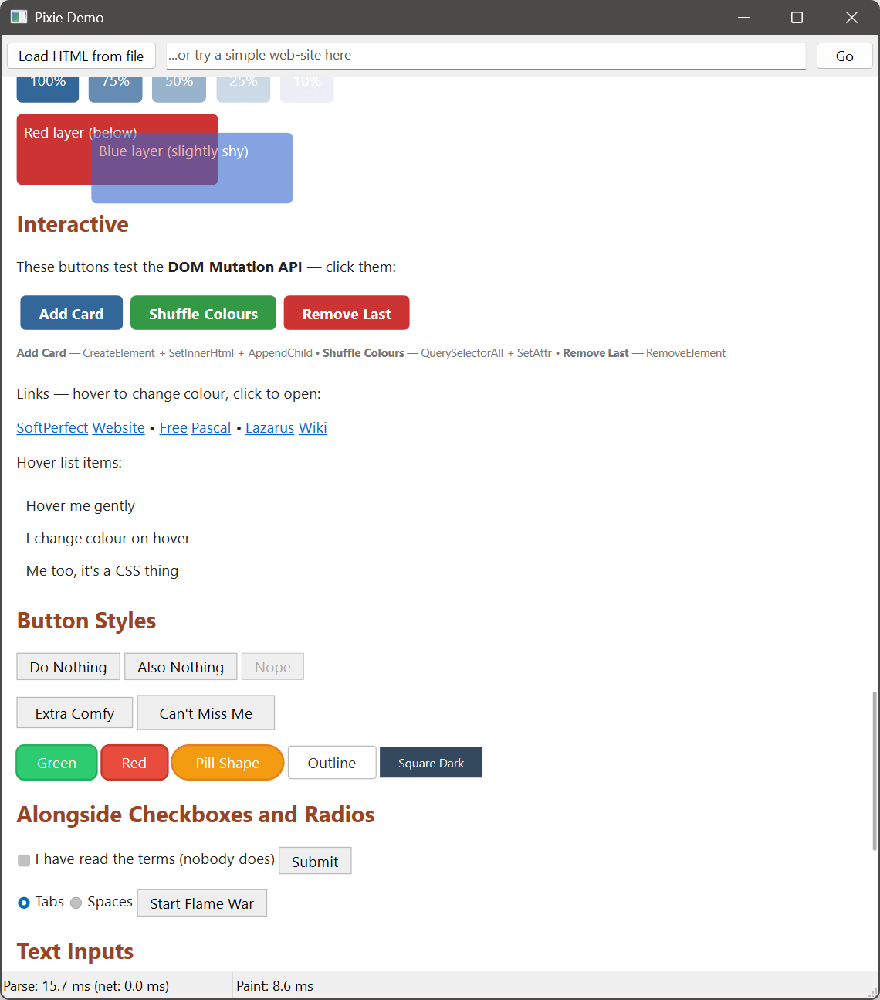
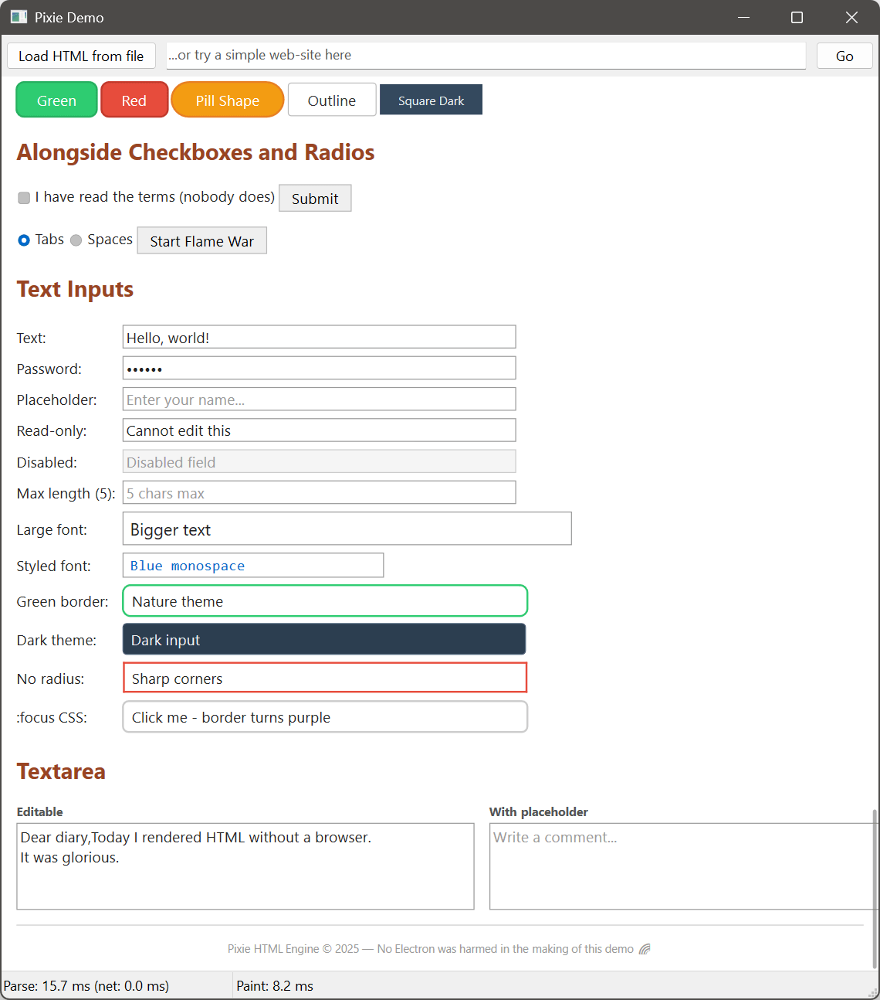

<p align="center">
  
</p>

<p align="center">
  A lightweight HTML/CSS rendering engine for Free Pascal (Lazarus) and Delphi (VCL &amp; FMX).
</p>

<p align="center">
  <a href="#features">Features</a> &middot;
  <a href="#screenshots">Screenshots</a> &middot;
  <a href="#getting-started">Getting Started</a> &middot;
  <a href="#usage">Usage</a> &middot;
  <a href="#download">Download</a> &middot;
  <a href="#licence">Licence</a>
</p>

---

Pixie is a set of drop-in visual components for Lazarus and Delphi that render HTML, SVG, Markdown, and custom graphics using platform-native APIs. No browser engine, no embedded Chromium, no external dependencies &mdash; just a single package you add to your project.

Five components are included: `TPixieHtmlView` (HTML/CSS rendering with interaction), `TPixieMarkdownView` (CommonMark + GFM Markdown), `TPixieSvgView` (proportional SVG display), `TPixiePaintBox` (drawing surface with a TCanvas-like API), and `TPixieTagBar` (interactive coloured tag pills with checking, editing, and colour cycling).

All drawing uses sub-pixel rendering, alpha blending, and hardware acceleration where available. Five rendering backends are included so the same code works across operating systems and frameworks:

| Platform | 2D Drawing | Text | Images |
|----------|-----------|------|--------|
| Windows (Lazarus, Delphi VCL) | Direct2D | DirectWrite | WIC |
| Delphi FMX (Windows, macOS, iOS, Android) | FMX Canvas | FMX TextLayout | FMX Bitmap |
| Linux (GTK2, GTK3) | Cairo | Pango | FPImage |
| macOS (Lazarus) | Core Graphics | Core Text | ImageIO |
| Qt5 / Qt6 (any platform) | QPainter | QFontMetrics | QImage |

## Features

**HTML**
- Full HTML5 tokeniser (68 states) and tree builder (23 insertion modes)
- 2125 named character entities
- Automatic tag closing, implicit elements, adoption agency algorithm, foster parenting
- SVG and MathML foreign content

**CSS**
- CSS3 tokeniser and parser (W3C CSS Syntax Level 3)
- Full cascade with specificity calculation
- Selectors: type, class, ID, attribute, combinators, `:nth-child()`, `:not()`, `:is()`, `:hover`, `:active`, `:focus`, `:checked`, `::before`/`::after`
- Box model, floats, positioning (static, relative, absolute, fixed)
- Flexbox and CSS Grid layout
- Gradients: `linear-gradient()`, `radial-gradient()`, `conic-gradient()` with repeating variants
- `@media` queries (Level 4 range syntax)
- Custom properties with `var()` support
- Built-in user-agent stylesheet (110 selectors)

**Layout**
- Block and inline formatting contexts with margin collapsing
- Table layout with `colspan`/`rowspan`
- Flexbox (row/column, wrap, grow/shrink, alignment)
- CSS Grid (explicit tracks, `fr` units, placement, spanning, auto-placement)
- Float positioning and clearing

**Interaction**
- Mouse hover, click, `:hover`/`:active` pseudo-class repainting, CSS cursors
- Text selection with mouse drag, double-click word select, Ctrl+C copy
- Owner-drawn form controls: text input, password, textarea, checkbox, radio, button
- Caret, selection, clipboard, undo, Tab/Shift+Tab focus cycling

**Images**
- Raster formats through each platform's native decoder (PNG, JPEG, GIF, BMP, and more)
- **WebP decoded by a built-in pure-Pascal decoder with no external dependency** &mdash; no `libwebp`, no DLL/`.so`/`.dylib` to ship. Covers lossy (VP8), lossless (VP8L), alpha, and animation, and renders identically on every backend
- Animated GIF, APNG, and animated WebP playback
- Load from file, stream, embedded resource (`@RESNAME` prefix), or `data:` URI

**Markdown**
- CommonMark 0.31.2 with GFM extensions (tables, strikethrough, task lists, autolinks)
- ~88% conformance against the official CommonMark spec test suite
- `TPixieMarkdownView` renders Markdown through the same HTML/CSS engine, so output is fully styleable and selectable
- GitHub-flavoured default stylesheet, toggleable via `UseDefaultStyles`
- Public `PixieMarkdownToHtml` / `PixieMarkdownToHtmlDocument` helpers for conversion without a view component

**PDF Export**
- Export any HTML or Markdown content to multi-page PDF with `TPixiePdfExport`
- TrueType font embedding with subsetting
- Searchable/selectable text, images, gradients, borders, opacity
- Configurable page size (A4, Letter, Legal, custom) and margins

**DOM API**
- `CreateElement`, `CreateTextNode`, `AppendChild`, `RemoveElement`
- `GetElementById`, `QuerySelector`, `QuerySelectorAll`
- `SetInnerHtml`, `SetElementText`, `SetAttr`, `AddStylesheet`
- Live DOM mutation with automatic re-render (`BeginUpdate`/`EndUpdate` for batching)

## Screenshots

<p align="center">
  
  
  
  
  
  
</p>

## Getting Started

### Lazarus (Free Pascal)

**Requirements:** [Lazarus](https://www.lazarus-ide.org/) with Free Pascal.

1. Open `package/Pixie.Package.Lazarus.lpk` in the Lazarus IDE.
2. Click **Compile**, then **Use > Install**.
3. Restart the IDE. `TPixieHtmlView`, `TPixieMarkdownView`, `TPixieSvgView`, `TPixiePaintBox`, and `TPixieTagBar` appear on the **Pixie** component palette tab.

Or add the package as a dependency without installing:

1. Open your project's `.lpi` in the IDE.
2. Go to **Project > Project Inspector > Add > New Requirement**.
3. Select `Pixie.Package.Lazarus`.

### Delphi (VCL)

**Requirements:** Embarcadero Delphi (Windows only, uses Direct2D/DirectWrite backend).

1. Open `package/Pixie.Package.Delphi.VCL.dpk` in the Delphi IDE.
2. Right-click the project in the Project Manager and select **Install**.
3. Components appear on the **Pixie** palette tab.

Or add the source files directly to your project without installing the package:

1. Add `source/common` and `source/htmlview` to your project's unit search path (plus `source/svgview` or `source/paintbox` if needed).
2. Add `Pixie.HtmlView.VCL` to your form's `uses` clause.

### Delphi (FMX)

**Requirements:** Embarcadero Delphi with FireMonkey. Supports Windows, macOS, iOS, and Android.

1. Open `package/Pixie.Package.Delphi.FMX.dpk` in the Delphi IDE.
2. Right-click the project in the Project Manager and select **Install**.
3. Components appear on the **Pixie** palette tab.

Or add the source files directly to your project without installing the package:

1. Add `source/common` and `source/htmlview` to your project's unit search path (plus `source/svgview` or `source/paintbox` if needed).
2. Add `Pixie.HtmlView.FMX` to your form's `uses` clause.

## Usage

Drop a `TPixieHtmlView` on a form:

```pascal
procedure TForm1.FormCreate(Sender: TObject);
begin
  PixieHtmlView1.LoadFromString(
    '<h1>Hello, Pixie!</h1>' +
    '<p style="color: steelblue;">Rendering HTML in Pascal.</p>');
end;
```

Load from a file:

```pascal
PixieHtmlView1.LoadFromFile('page.html');
```

Handle link clicks:

```pascal
procedure TForm1.PixieHtmlView1AnchorClick(Sender: TObject; const Url: string);
begin
  // handle the click as desired
end;
```

Render Markdown:

```pascal
PixieMarkdownView1.LoadMarkdownFromString(
  '# Hello' + sLineBreak +
  '' + sLineBreak +
  'Markdown with *emphasis*, **strong**, `code`, and a [link](https://example.com).');
```

Or convert Markdown to HTML without a component:

```pascal
uses Pixie.Markdown;

Html := PixieMarkdownToHtml('# Title' + sLineBreak + sLineBreak +
  '- one' + sLineBreak + '- two');
```

Export to PDF:

```pascal
uses Pixie.PdfExport;

var
  Pdf: TPixiePdfExport;
begin
  Pdf := TPixiePdfExport.Create;
  try
    Pdf.Title := 'My Document';
    Pdf.SaveToFile(PixieHtmlView1.Lines.Text, 'output.pdf');
  finally
    Pdf.Free;
  end;
end;
```

Mutate the DOM at runtime:

```pascal
var
  Doc: TPixieDocument;
  El: TPixieElement;
begin
  Doc := PixieHtmlView1.Document;
  Doc.BeginUpdate;
  try
    El := Doc.CreateElement('div', nil);
    Doc.SetInnerHtml(El, '<strong>Added dynamically</strong>');
    Doc.Root.AppendChild(El);
  finally
    Doc.EndUpdate;
  end;
end;
```

## Download

Pre-built demo application for Windows:

[**Download latest release**](https://gitlab.com/api/v4/projects/retrofoxed%2Fpixie/packages/generic/pixie-demo/1.0.0/PixieDemo-win64.zip)

## Licence

[MIT](LICENSE) &copy; [SoftPerfect Pty Ltd](https://www.softperfect.com)
